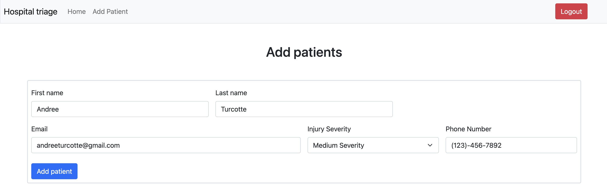
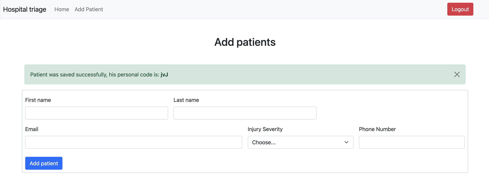
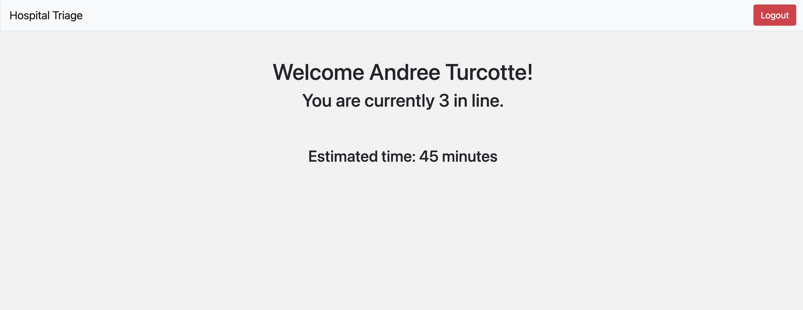

# Emergency Waitlist

The "Hospital Triage" app helps admins and patients better understand wait times in the emergency room. The request will be administered by hospital admins based on two dimensions of triage: severity of injury and length of time a patient has already been in the queue. Admins can see the full list of patients, but users (eg patients) can login with their name and 3-letter code showing an approximate wait time, which is updated as patients are processed.

## DB Design 

  * [Database Design](/docs/db.md), 
  * [Database schema (SQL)](/db/schema.sql), 
  * [Data examples (SQL)](/db/seed.sql).

## Run the application

1- Set up the DB

```bash
  psql -U postgres
  postgres=# CREATE DATABASE emergency_waitlist;
  postgres=# \c emergency_waitlist
  emergency_waitlist=# \i db/schema.sql
  emergency_waitlist=# \i db/seed.sql
```
2- Run the PHP server

```bash
  cd public
  php -S localhost:4000
```

## How to use the application

### Use as an admins

1. The admins must go to `localhost:4000/admin/` and login with username/password `admin` 
2. Once the credentials are verified the admin will be displayed the list of users in the queue

3. The first user in the list is the one who is currently supposed to be served. The queue is updated everytime that a new patient is added or when the patient currently served is marked as served thus removed from the list
4. To add a patient click on the navbar link (`Add patients`). You will be redirected to the page shown below to add a new patient. 

5. When the patient is successfully saved is personal 3 characters code is shown to the admin so that he can communicate it with the patient recently arrived. This code will be used by the client to log in and check is place in queue

6. The admin can go back to the home page to see the updated list of patients in the queue


### Use as a patients

1. The patients must go to `localhost:4000/` and login with last name and their personal 3 characters code given to them by the admin during their registration process. If the login is successful, the patient will be redirected to the home page where is estimated time and place in queue is shown. 
2. If the client is first in line he will see the following information

3. If the client is not the first in line he will see the following information. 

4. The estimated time will be updated everytime that a patient is removed from the queue by the admin or added if is injury severity is higher


***NOTE : To use the application please open 2 windows one for the Admin interface and one for the Patient interface and follow the instructions mentioned above***
